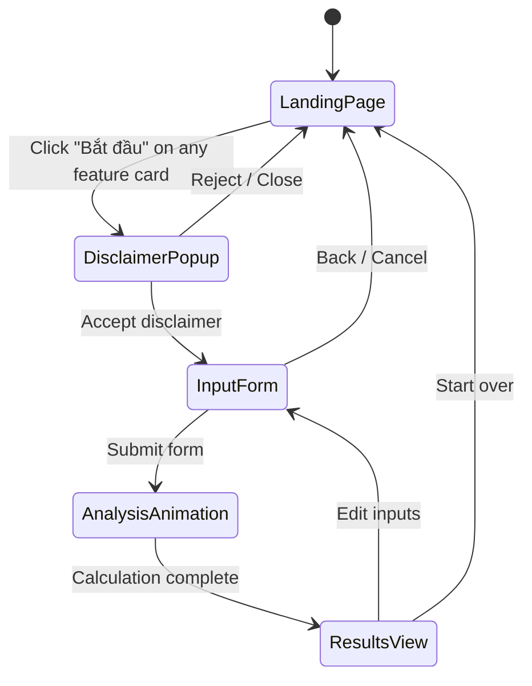
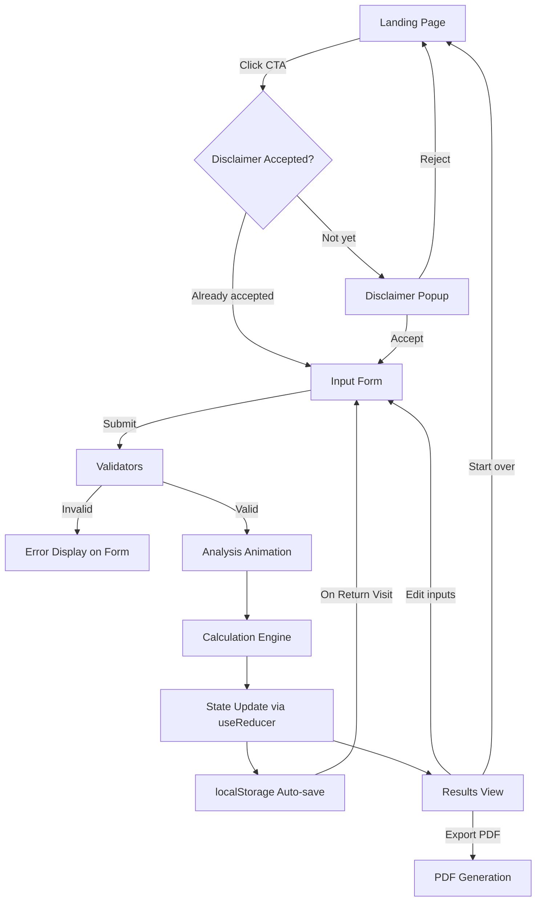

# Design Document

## Overview

Website tĩnh (static site) hỗ trợ chủ tiệm nail gốc Việt tại Mỹ chuyển đổi phương thức trả lương từ cash/check sang 100% check. Ứng dụng sử dụng React 18 + TypeScript + Vite + Tailwind CSS, chạy hoàn toàn trên client-side. Không cần backend server — mọi tính toán thực hiện trên trình duyệt và dữ liệu lưu trữ bằng localStorage. Deploy dưới dạng Single Page Application (SPA).

**Tính năng chính:**

- Lộ trình chuyển đổi theo giai đoạn (3-6 phases, 6-18 tháng)
- Công cụ tính toán lương/thuế cho cả W-2 và 1099
- Khuyến cáo tránh Red Flag IRS
- Hướng dẫn phân loại W-2 vs 1099
- Disclaimer, Privacy Policy, popup xác nhận lần đầu
- Giao diện hoàn toàn tiếng Việt
- Xuất PDF, lưu/tải lại dữ liệu từ localStorage

## Architecture

### Technology Stack

| Layer            | Technology                                   | Lý do                                        |
| ---------------- | -------------------------------------------- | -------------------------------------------- |
| Framework        | React 18 + TypeScript                        | Component-based, type safety, ecosystem mạnh |
| Build Tool       | Vite                                         | Fast build, HMR, zero-config                 |
| Styling          | Tailwind CSS                                 | Utility-first, responsive dễ dàng            |
| State Management | React Context + useReducer                   | Đủ cho app nhỏ, không cần Redux              |
| PDF Export       | jsPDF                                        | Client-side PDF generation                   |
| Animation        | Framer Motion                                | Smooth transitions between flow steps        |
| Testing          | Vitest + React Testing Library + fast-check  | Fast, Vite-native, PBT support               |
| Deployment       | Static hosting (Vercel/Netlify/GitHub Pages) | Free, fast, no server needed                 |

**Note:** No client-side routing library is needed. The app uses a single-page sequential flow managed by React state, not URL-based navigation.

### UX Flow Architecture

The application follows a linear single-page flow rather than multi-page SPA routing:



**Flow steps:**

1. **Landing Page** — Feature showcase with visual cards. Each card has a CTA button.
2. **Disclaimer Popup** — Triggered by clicking any "Bắt đầu" button. Must accept before proceeding. (Not triggered on first visit globally — only on action.)
3. **Input Form** — Collects all parameters: revenue, split ratio, number of workers, cash %, state, W-2/1099, hours/week.
4. **Analysis Animation** — Loading/analyzing animation while calculations run.
5. **Results View** — Unified view showing all results together: lộ trình chuyển đổi, W-2 vs 1099 comparison, and IRS warnings/red flags.

### Project Structure

```
src/
├── components/
│   ├── layout/
│   │   ├── Header.tsx              # Minimal header with logo
│   │   ├── Footer.tsx              # Footer with links to Disclaimer & Privacy
│   │   ├── MobileMenu.tsx          # Hamburger menu (<768px)
│   │   └── DisclaimerBanner.tsx    # Persistent disclaimer reminder banner
│   ├── landing/
│   │   ├── LandingPage.tsx         # Main landing with feature cards
│   │   ├── FeatureCard.tsx         # Individual feature card with CTA
│   │   └── HeroSection.tsx         # Top hero/intro section
│   ├── disclaimer/
│   │   ├── DisclaimerPopup.tsx     # Action-triggered disclaimer modal
│   │   ├── DisclaimerPage.tsx      # Full disclaimer content page (footer link)
│   │   └── PrivacyPolicyPage.tsx   # Privacy policy content page (footer link)
│   ├── form/
│   │   ├── InputForm.tsx           # Unified input form (all parameters)
│   │   ├── RevenueInput.tsx        # Revenue field
│   │   ├── SplitRatioInput.tsx     # Split ratio selector (4/6, 5/5, 3/7)
│   │   ├── WorkerCountInput.tsx    # Number of workers
│   │   ├── CashPercentInput.tsx    # Current cash percentage slider/input
│   │   ├── StateSelector.tsx       # State dropdown
│   │   ├── WorkerTypeToggle.tsx    # W-2 / 1099 toggle
│   │   └── HoursPerWeekInput.tsx   # Hours per week (for min wage check)
│   ├── animation/
│   │   ├── AnalysisAnimation.tsx   # Loading/analyzing animation container
│   │   ├── ProgressIndicator.tsx   # Step-by-step progress display
│   │   └── AnimationGraphics.tsx   # Visual animation elements (charts, icons)
│   ├── results/
│   │   ├── ResultsView.tsx         # Unified results container
│   │   ├── RoadmapSection.tsx      # Lộ trình chuyển đổi (phases timeline)
│   │   ├── PhaseCard.tsx           # Individual phase in the roadmap
│   │   ├── ComparisonSection.tsx   # W-2 vs 1099 comparison
│   │   ├── TaxBreakdown.tsx        # Detailed tax breakdown
│   │   ├── WarningsSection.tsx     # IRS red flags and warnings
│   │   ├── RedFlagCard.tsx         # Individual red flag card
│   │   ├── TipReportingNote.tsx    # Tip reporting guidance
│   │   ├── MinimumWageWarning.tsx  # Minimum wage violation alert
│   │   ├── CostSummary.tsx         # Before/after cost comparison
│   │   └── PdfExportButton.tsx     # Export all results to PDF
│   ├── classification/
│   │   ├── ComparisonChart.tsx     # W-2 vs 1099 comparison table
│   │   ├── ClassificationChecklist.tsx # IRS criteria checklist
│   │   └── SplitModelGuide.tsx     # Commission split explanation
│   └── common/
│       ├── ConfirmDialog.tsx       # Reusable confirmation modal
│       ├── ErrorMessage.tsx        # Input validation error display
│       └── BackButton.tsx          # Navigation back within flow
├── utils/
│   ├── taxCalculator.ts            # Core tax calculation logic
│   ├── roadmapGenerator.ts         # Transition roadmap algorithm
│   ├── formatters.ts               # USD formatting, percentage
│   ├── validators.ts               # Input validation
│   ├── storage.ts                  # localStorage wrapper
│   └── pdfExport.ts               # PDF generation with jsPDF
├── data/
│   ├── taxRates.ts                 # Federal tax rates (2024)
│   ├── stateData.ts                # State-specific SUTA, income tax
│   ├── redFlags.ts                 # IRS red flag content (Vietnamese)
│   ├── featureCards.ts             # Landing page feature card content
│   └── classificationCriteria.ts   # W-2 vs 1099 criteria
├── context/
│   ├── AppContext.tsx              # Global state provider
│   ├── FlowContext.tsx             # Flow step state management
│   └── types.ts                    # TypeScript interfaces
├── hooks/
│   ├── useCalculator.ts           # Calculator logic hook
│   ├── useRoadmap.ts              # Roadmap generation hook
│   ├── useLocalStorage.ts         # Persistent storage hook
│   ├── useFlowNavigation.ts      # Flow step navigation hook
│   └── useAnalysisAnimation.ts   # Animation timing/sequencing hook
├── App.tsx
├── main.tsx
└── index.css
```

### Data Flow



### Flow State Management

The app uses a `FlowContext` to track which step the user is on. No URL routing needed.

| Step         | Component         | Description                                             |
| ------------ | ----------------- | ------------------------------------------------------- |
| `landing`    | LandingPage       | Feature cards showcase                                  |
| `disclaimer` | DisclaimerPopup   | Modal overlay (shown on CTA click if not yet accepted)  |
| `form`       | InputForm         | All input fields in one form                            |
| `analyzing`  | AnalysisAnimation | Animated transition (1.5-3s) while calculations execute |
| `results`    | ResultsView       | All results unified: roadmap + comparison + warnings    |

Footer links to Disclaimer and Privacy Policy pages render as overlay/modal content accessible from any flow step.

## Components and Interfaces

### Core Utility Modules

#### taxCalculator.ts

```typescript
export interface TaxInput {
  monthlyRevenue: number;
  splitRatio: { owner: number; worker: number };
  numberOfWorkers: number;
  currentCashPercent: number;
  workerType: "W2" | "1099";
  state: string;
  hoursPerWeek?: number; // For minimum wage check (W-2 only)
}

export interface EmployerTaxes {
  socialSecurity: number; // 6.2% of wages up to $168,600 (2024)
  medicare: number; // 1.45% of all wages
  futa: number; // 0.6% of first $7,000
  suta: number; // State-specific rate
  total: number;
}

export interface EmployeeTaxes {
  federalIncome: number;
  stateIncome: number;
  socialSecurity: number; // 6.2%
  medicare: number; // 1.45%
  total: number;
}

export interface SelfEmploymentTaxes {
  selfEmploymentTax: number; // 15.3% (12.4% SS + 2.9% Medicare)
  estimatedQuarterlyTax: number;
  total: number;
}

export interface TaxResult {
  workerGrossIncome: number;
  currentTaxedPortion: number;
  projectedTaxedPortion: number;

  // W-2 specific
  employerTaxes?: EmployerTaxes;
  employeeTaxes?: EmployeeTaxes;

  // 1099 specific
  selfEmploymentTaxes?: SelfEmploymentTaxes;

  // Comparison
  currentEmployerCostPerMonth: number;
  projectedEmployerCostPerMonth: number;
  additionalCostPerMonth: number;
  additionalCostPerYear: number;

  // Worker take-home
  currentWorkerTakeHome: number;
  projectedWorkerTakeHome: number;

  // Warnings
  minimumWageViolation: boolean;
  form1099Required: boolean; // true if >= $600/year
}

export function calculateTax(input: TaxInput): TaxResult;
export function calculateW2Tax(
  grossIncome: number,
  state: string,
): { employer: EmployerTaxes; employee: EmployeeTaxes };
export function calculate1099Tax(
  grossIncome: number,
  state: string,
): SelfEmploymentTaxes;
export function compareW2vs1099(input: TaxInput): {
  w2Result: TaxResult;
  result1099: TaxResult;
};
```

#### roadmapGenerator.ts

```typescript
export interface RoadmapInput {
  currentCashPercent: number; // 0-100
  splitRatio: { owner: number; worker: number };
  workerType: "W2" | "1099";
}

export interface Phase {
  phaseNumber: number;
  checkPercent: number;
  cashPercent: number;
  durationMonths: number;
  startMonth: number;
  endMonth: number;
  notes: string;
}

export interface Roadmap {
  phases: Phase[];
  totalDurationMonths: number;
  recommendation: string;
}

export function generateRoadmap(input: RoadmapInput): Roadmap;
```

#### validators.ts

```typescript
export interface ValidationResult {
  valid: boolean;
  errors: ValidationError[];
}

export interface ValidationError {
  field: string;
  message: string; // Vietnamese
}

export function validateCashPercent(value: number): ValidationResult;
export function validateSplitRatio(
  owner: number,
  worker: number,
): ValidationResult;
export function validateRevenue(value: number): ValidationResult;
export function validateWorkerCount(value: number): ValidationResult;
export function validateCalculatorInput(input: TaxInput): ValidationResult;
export function validateRoadmapInput(input: RoadmapInput): ValidationResult;
```

#### storage.ts

```typescript
export interface StoredData {
  calculatorInput?: TaxInput;
  calculatorResult?: TaxResult;
  roadmapInput?: RoadmapInput;
  roadmapResult?: Roadmap;
  classificationAnswers?: Record<string, boolean>;
  disclaimerAccepted: boolean;
  lastUpdated: string; // ISO date
}

export function saveData(data: Partial<StoredData>): void;
export function loadData(): StoredData | null;
export function clearAllData(): void;
export function hasStoredData(): boolean;
```

#### formatters.ts

```typescript
export function formatUSD(amount: number): string; // $1,234.56
export function formatPercent(value: number): string; // 60%
export function formatRatio(owner: number, worker: number): string; // "4/6"
export function formatMonth(month: number): string; // "Tháng 3"
```

#### pdfExport.ts

```typescript
export interface PdfContent {
  title: string;
  calculatorResult?: TaxResult;
  comparisonResult?: { w2Result: TaxResult; result1099: TaxResult };
  roadmap?: Roadmap;
  generatedDate: string;
  disclaimer: string;
}

export function exportToPdf(content: PdfContent): void;
```

### Flow State Management

#### FlowContext.tsx

```typescript
export type FlowStep =
  | "landing"
  | "disclaimer"
  | "form"
  | "analyzing"
  | "results";

export interface FlowState {
  currentStep: FlowStep;
  disclaimerAccepted: boolean;
  showDisclaimerPage: boolean; // For footer link (overlay)
  showPrivacyPage: boolean; // For footer link (overlay)
}

export type FlowAction =
  | { type: "START_FEATURE" } // CTA click → shows disclaimer or goes to form
  | { type: "ACCEPT_DISCLAIMER" } // Accept → go to form
  | { type: "REJECT_DISCLAIMER" } // Reject → back to landing
  | { type: "SUBMIT_FORM" } // Submit → go to analyzing
  | { type: "ANALYSIS_COMPLETE" } // Done → show results
  | { type: "EDIT_INPUTS" } // From results → back to form
  | { type: "START_OVER" } // From results → back to landing
  | { type: "SHOW_DISCLAIMER_PAGE"; show: boolean }
  | { type: "SHOW_PRIVACY_PAGE"; show: boolean };

export function flowReducer(state: FlowState, action: FlowAction): FlowState;
```

### React Components (Key Interfaces)

#### LandingPage

```typescript
interface LandingPageProps {
  onStartFeature: () => void;
  features: FeatureCardData[];
}

interface FeatureCardData {
  id: string;
  icon: React.ReactNode;
  title: string; // Vietnamese
  description: string; // Vietnamese
  ctaLabel: string; // Vietnamese CTA button text
}
```

Landing page hiển thị tất cả tính năng chính dưới dạng visual cards. Mỗi card có nút "Bắt đầu" trigger disclaimer popup.

#### FeatureCard

```typescript
interface FeatureCardProps {
  feature: FeatureCardData;
  onStart: () => void;
}
```

Card đơn lẻ hiển thị: icon, tiêu đề, mô tả ngắn, và CTA button.

#### DisclaimerPopup

```typescript
interface DisclaimerPopupProps {
  isVisible: boolean;
  onAccept: () => void;
  onReject: () => void;
}
```

Popup hiển thị khi user click "Bắt đầu" trên bất kỳ feature card nào (không phải lần đầu truy cập globally). Yêu cầu xác nhận trước khi cho phép tiếp tục vào form. Lưu trạng thái accepted vào localStorage — nếu đã accepted trước đó, skip popup và đi thẳng vào form.

#### InputForm

```typescript
interface InputFormProps {
  initialValues?: TaxInput;
  onSubmit: (input: TaxInput) => void;
  onBack: () => void;
}
```

Form hợp nhất thu thập tất cả thông số đầu vào trong một trang: doanh thu trung bình, tỉ lệ ăn chia, số thợ, tỉ lệ cash%, state, W-2/1099, giờ làm/tuần. Hiển thị inline validation errors.

#### AnalysisAnimation

```typescript
interface AnalysisAnimationProps {
  isActive: boolean;
  onComplete: () => void;
  duration?: number; // Default: 2000ms
}
```

Hiển thị animation (loading/analyzing effect) sau khi submit form. Bao gồm:

- Progress indicator với các bước: "Đang tính toán thuế...", "Đang tạo lộ trình...", "Đang phân tích rủi ro..."
- Visual animation (spinning charts, number counters, etc.)
- Minimum display time 1.5s để tạo cảm giác xử lý chuyên nghiệp, tối đa 3s
- Gọi `onComplete` khi animation kết thúc VÀ calculation đã hoàn tất

#### ResultsView

```typescript
interface ResultsViewProps {
  taxResult: TaxResult;
  comparisonResult: { w2Result: TaxResult; result1099: TaxResult };
  roadmap: Roadmap;
  input: TaxInput;
  onEditInputs: () => void;
  onStartOver: () => void;
  onExportPdf: () => void;
}
```

Unified results page hiển thị tất cả kết quả cùng một trang, chia thành 3 sections chính:

1. **RoadmapSection** — Lộ trình chuyển đổi theo phases (timeline view)
2. **ComparisonSection** — So sánh W-2 vs 1099 (bảng chi tiết)
3. **WarningsSection** — Các cảnh báo IRS red flags liên quan đến input của user

Có nút "Chỉnh sửa thông tin" (back to form) và "Xuất PDF" (export all results).

#### RoadmapSection

```typescript
interface RoadmapSectionProps {
  roadmap: Roadmap;
  currentCashPercent: number;
}
```

Hiển thị lộ trình chuyển đổi dưới dạng timeline/phases. Mỗi phase hiển thị: tỉ lệ mục tiêu, thời gian, ghi chú.

#### ComparisonSection

```typescript
interface ComparisonSectionProps {
  w2Result: TaxResult;
  result1099: TaxResult;
  input: TaxInput;
}
```

Bảng so sánh song song W-2 vs 1099: employer cost, employee take-home, tax breakdown.

#### WarningsSection

```typescript
interface WarningSectionProps {
  input: TaxInput;
  taxResult: TaxResult;
  roadmap: Roadmap;
}
```

Hiển thị danh sách red flags liên quan dựa trên input của user (ví dụ: nếu cash% > 60% → highlight warning về sudden change). Bao gồm tip reporting guidance và minimum wage warning nếu applicable.

#### DisclaimerBanner

```typescript
interface DisclaimerBannerProps {
  // No props needed — always visible across all flow steps
}
```

Banner nhắc nhở tham vấn CPA/luật sư thuế, hiển thị persistent ở mọi step trong flow.

## Data Models

### Application State

```typescript
interface AppState {
  // Flow
  currentStep: FlowStep;
  disclaimerAccepted: boolean;

  // Calculator
  calculatorInput: TaxInput | null;
  calculatorResult: TaxResult | null;
  comparisonResult: { w2Result: TaxResult; result1099: TaxResult } | null;

  // Roadmap
  roadmapInput: RoadmapInput | null;
  roadmapResult: Roadmap | null;

  // Classification
  classificationAnswers: Record<string, boolean>;
  classificationResult: "W2" | "1099" | null;

  // Overlay pages (footer links)
  showDisclaimerPage: boolean;
  showPrivacyPage: boolean;

  // Meta
  lastUpdated: string | null;
}
```

### Tax Rates Data

```typescript
interface FederalTaxBracket {
  min: number;
  max: number;
  rate: number;
}

interface StateData {
  code: string;
  name: string; // English
  nameVi: string; // Vietnamese
  sutaRate: number; // State Unemployment Tax rate
  stateIncomeTaxRate: number; // Simplified effective rate
}

interface TaxRatesConfig {
  year: number;
  socialSecurityRate: number; // 0.062
  socialSecurityWageCap: number; // 168600
  medicareRate: number; // 0.0145
  futaRate: number; // 0.006
  futaWageCap: number; // 7000
  selfEmploymentRate: number; // 0.153
  federalMinimumWage: number; // 7.25
  federalTaxBrackets: FederalTaxBracket[];
}
```

### Red Flag Data

```typescript
interface RedFlag {
  id: string;
  title: string; // Vietnamese
  description: string; // Vietnamese
  prevention: string; // How to avoid
  severity: "high" | "medium" | "low";
  relatedToTransition: boolean;
}
```

### Classification Criteria

```typescript
interface ClassificationQuestion {
  id: string;
  category: "behavioral" | "financial" | "relationship";
  question: string; // Vietnamese
  explanation: string; // Vietnamese
  w2Indicator: boolean; // true if "yes" answer points to W-2
}
```

### localStorage Schema

Key: `nail-salon-payroll-data`

```json
{
  "calculatorInput": { ... },
  "calculatorResult": { ... },
  "comparisonResult": { "w2Result": { ... }, "result1099": { ... } },
  "roadmapInput": { ... },
  "roadmapResult": { ... },
  "classificationAnswers": { "q1": true, "q2": false, ... },
  "disclaimerAccepted": true,
  "lastUpdated": "2024-01-15T10:30:00.000Z"
}
```

Key: `nail-salon-disclaimer-accepted`

```json
true
```

### Feature Cards Data

```typescript
interface FeatureCardConfig {
  id: string;
  icon: string; // Icon identifier (e.g., "roadmap", "calculator", "warning")
  title: string; // Vietnamese title
  description: string; // Vietnamese short description
  ctaLabel: string; // CTA button label (Vietnamese)
}
```

Feature cards displayed on the landing page:

1. **Lộ trình chuyển đổi** — Xem lộ trình từng bước chuyển từ cash sang check
2. **Tính toán lương & thuế** — Ước lượng chi phí thuế khi chuyển đổi
3. **Cảnh báo IRS** — Các dấu hiệu bất thường cần tránh
4. **So sánh W-2 vs 1099** — Chọn hình thức lao động phù hợp

### Core Algorithms

#### Roadmap Generation Logic

- Cash ≤ 30%: 3 phases over 6 months (giảm ~10% mỗi 2 tháng)
- Cash 31-60%: 4 phases over 9-12 months (giảm ~15% mỗi 2-3 tháng)
- Cash > 60%: 5-6 phases over 12-18 months (giảm ~10-12% mỗi 2-3 tháng)
- Constraint: Mỗi phase giảm tối đa 15% cash để tránh Red Flag

#### Tax Calculation Logic

1. `workerGrossIncome = monthlyRevenue × (worker / (owner + worker))`
2. `currentTaxedPortion = workerGrossIncome × (checkPercent / 100)`
3. `projectedTaxedPortion = workerGrossIncome × 100%`
4. Apply W-2 or 1099 tax formulas to taxed portions
5. `additionalCost = taxOnProjected - taxOnCurrent`

#### Minimum Wage Check (W-2 only)

```
hourlyRate = (workerGrossIncome / numberOfWorkers) / (hoursPerWeek × 4.33)
if hourlyRate < 7.25 → minimumWageViolation = true
```

## Correctness Properties

_A property is a characteristic or behavior that should hold true across all valid executions of a system — essentially, a formal statement about what the system should do. Properties serve as the bridge between human-readable specifications and machine-verifiable correctness guarantees._

### Property 1: Roadmap phases are complete and well-structured

_For any_ valid RoadmapInput (cashPercent in [0, 100], positive split ratio), the generated Roadmap SHALL contain at least 3 phases, each with a valid phaseNumber, checkPercent + cashPercent = 100, positive durationMonths, non-negative startMonth, and non-empty notes string. The first phase's cashPercent SHALL be less than the input cashPercent, and the last phase's cashPercent SHALL be 0.

**Validates: Requirements 1.1, 1.4**

### Property 2: Roadmap duration scales with cash percentage

_For any_ valid RoadmapInput, IF currentCashPercent ≤ 60% THEN totalDurationMonths SHALL be between 6 and 12 (inclusive) with at least 3 phases, AND IF currentCashPercent > 60% THEN totalDurationMonths SHALL be between 12 and 18 (inclusive) with at least 5 phases. Additionally, no single phase SHALL reduce cash percentage by more than 15 percentage points.

**Validates: Requirements 1.2, 1.3**

### Property 3: Worker income calculation correctness

_For any_ valid TaxInput with positive monthlyRevenue and positive split ratio (owner, worker), the calculated workerGrossIncome SHALL equal `monthlyRevenue × (worker / (owner + worker))` within floating-point tolerance (±0.01).

**Validates: Requirements 2.1, 2.12**

### Property 4: W-2 employer tax calculation correctness

_For any_ valid gross income and state, the W-2 employer taxes SHALL satisfy: socialSecurity = min(grossIncome, 168600) × 0.062, medicare = grossIncome × 0.0145, futa = min(grossIncome, 7000) × 0.006, and suta = min(grossIncome, sutaWageCap) × stateRate. The total SHALL equal the sum of all components.

**Validates: Requirements 2.3**

### Property 5: W-2 employee tax calculation correctness

_For any_ valid gross income and state, the W-2 employee taxes SHALL satisfy: socialSecurity = min(grossIncome, 168600) × 0.062, medicare = grossIncome × 0.0145, and both federalIncome and stateIncome SHALL be non-negative and less than grossIncome. The total SHALL equal the sum of all components.

**Validates: Requirements 2.4**

### Property 6: 1099 self-employment tax calculation

_For any_ valid gross income with workerType = '1099', the selfEmploymentTax SHALL equal `grossIncome × 0.9235 × 0.153` within floating-point tolerance, and estimatedQuarterlyTax SHALL equal `(annualSETax + estimatedIncomeTax) / 4`.

**Validates: Requirements 2.5**

### Property 7: Form 1099-NEC threshold detection

_For any_ valid TaxInput with workerType = '1099', the form1099Required flag SHALL be true IF AND ONLY IF the worker's annual gross income (monthlyRevenue × 12 × workerRatio) is greater than or equal to $600.

**Validates: Requirements 2.6**

### Property 8: Cost comparison monotonicity

_For any_ valid TaxInput where currentCashPercent > 0, the projectedEmployerCostPerMonth SHALL be greater than or equal to currentEmployerCostPerMonth (since declaring more income on payroll always increases the tax burden).

**Validates: Requirements 2.7**

### Property 9: Minimum wage violation detection

_For any_ valid TaxInput with workerType = 'W2' and hoursPerWeek > 0, minimumWageViolation SHALL be true IF AND ONLY IF `(workerGrossIncome / numberOfWorkers) / (hoursPerWeek × 4.33) < 7.25`.

**Validates: Requirements 2.10**

### Property 10: USD formatting correctness

_For any_ non-negative number, formatUSD SHALL produce a string matching the pattern `$X,XXX.XX` (dollar sign, comma-separated thousands, exactly 2 decimal places). Additionally, parsing the formatted string back to a number SHALL produce the original value rounded to 2 decimal places.

**Validates: Requirements 4.3**

### Property 11: Storage round-trip preservation

_For any_ valid StoredData object, saving to localStorage and then loading SHALL produce a value deeply equal to the original object.

**Validates: Requirements 5.1, 5.2**

### Property 12: Storage clear operation

_For any_ valid StoredData object, after saving and then calling clearAllData(), loadData() SHALL return null and hasStoredData() SHALL return false.

**Validates: Requirements 5.4**

### Property 13: Invalid input rejection

_For any_ cashPercent value outside [0, 100], OR any non-positive split ratio, OR any negative revenue, OR any non-positive worker count, the corresponding validator SHALL return `{ valid: false }` with at least one error message in Vietnamese.

**Validates: Requirements 1.5**

### Property 14: Classification checklist scoring consistency

_For any_ set of boolean answers to classification questions, IF the number of W2-indicator answers exceeds the number of 1099-indicator answers THEN the recommendation SHALL be 'W2', and vice versa. The classification SHALL be deterministic (same answers always produce same result).

**Validates: Requirements 6.2**

## Error Handling

### Input Validation Errors

| Field         | Condition                     | Error Message (Vietnamese)          |
| ------------- | ----------------------------- | ----------------------------------- |
| Tỉ lệ cash    | < 0 hoặc > 100                | "Tỉ lệ cash phải từ 0% đến 100%"    |
| Tỉ lệ ăn chia | ≤ 0 cho owner hoặc worker     | "Tỉ lệ ăn chia phải là số dương"    |
| Doanh thu     | ≤ 0                           | "Doanh thu phải lớn hơn 0"          |
| Số thợ        | ≤ 0 hoặc không phải số nguyên | "Số thợ phải là số nguyên dương"    |
| Giờ làm/tuần  | ≤ 0 hoặc > 168                | "Số giờ làm việc phải từ 1 đến 168" |

### Calculation Edge Cases

| Scenario                              | Handling                                                           |
| ------------------------------------- | ------------------------------------------------------------------ |
| Cash = 0% (already 100% check)        | Show message: "Bạn đã hoạt động 100% check. Không cần chuyển đổi." |
| Very small revenue (< $100/month)     | Allow calculation but show note about accuracy                     |
| Social Security wage cap exceeded     | Cap SS calculation at $168,600 annual                              |
| Division by zero (owner + worker = 0) | Prevented by validation (both must be > 0)                         |

### localStorage Errors

| Scenario                                    | Handling                                                                                                                     |
| ------------------------------------------- | ---------------------------------------------------------------------------------------------------------------------------- |
| localStorage unavailable (private browsing) | Show warning: "Trình duyệt không hỗ trợ lưu dữ liệu. Dữ liệu sẽ mất khi đóng trang." Continue operation without persistence. |
| Corrupted stored data                       | Catch JSON parse error, reset to null, continue with empty state                                                             |
| Storage quota exceeded                      | Catch QuotaExceededError, show warning, continue without save                                                                |

### PDF Export Errors

| Scenario                        | Handling                                                                      |
| ------------------------------- | ----------------------------------------------------------------------------- |
| jsPDF fails to generate         | Show error: "Không thể tạo PDF. Vui lòng thử lại."                            |
| Vietnamese font rendering issue | Use embedded font subset or fallback to basic Latin with transliteration note |

### UI Error Boundary

React Error Boundary wraps the entire app to catch unexpected rendering errors and display a Vietnamese-language fallback UI with option to reload.

## Testing Strategy

### Dual Testing Approach

This feature uses both unit tests (specific examples, edge cases) and property-based tests (universal properties across generated inputs) for comprehensive coverage.

### Testing Tools

- **Vitest**: Test runner (Vite-native, fast)
- **React Testing Library**: Component testing
- **fast-check**: Property-based testing library for TypeScript
- **jsdom**: DOM environment for component tests

### Property-Based Tests

Each correctness property from the design document is implemented as a property-based test using `fast-check`.

**Configuration:**

- Minimum 100 iterations per property test
- Each test tagged with design property reference
- Tag format: `Feature: nail-salon-payroll-transition, Property {number}: {property_text}`

**Property tests cover:**

- `taxCalculator.ts` — Properties 3, 4, 5, 6, 7, 8, 9
- `roadmapGenerator.ts` — Properties 1, 2
- `formatters.ts` — Property 10
- `storage.ts` — Properties 11, 12
- `validators.ts` — Property 13
- Classification scoring — Property 14

### Unit Tests (Example-Based)

Unit tests cover specific examples, integration points, and static content:

| Area                   | Tests                                                       |
| ---------------------- | ----------------------------------------------------------- |
| Tax calculator         | Specific known-value calculations for W-2 and 1099          |
| Roadmap generator      | Specific scenarios (30% cash, 50% cash, 75% cash)           |
| Red flags data         | All items have required fields, specific flags exist        |
| Flow navigation        | Step transitions: landing→disclaimer→form→analyzing→results |
| DisclaimerPopup        | Shows on CTA click, hides on accept/reject, persists state  |
| AnalysisAnimation      | Fires onComplete after duration, shows progress steps       |
| ResultsView            | Renders all three sections (roadmap, comparison, warnings)  |
| InputForm              | Validates inputs, shows errors, pre-fills from localStorage |
| PDF export             | exportToPdf called with correct structure                   |
| Responsive             | Mobile menu renders at <768px                               |
| Vietnamese content     | Key terms follow "Vietnamese (English)" format              |
| W-2 vs 1099 comparison | compareW2vs1099 returns both result types                   |
| Performance            | Calculation completes under 1 second                        |

### Integration / Smoke Tests

| Test                                | Purpose                                                           |
| ----------------------------------- | ----------------------------------------------------------------- |
| No outbound network requests        | Verify no fetch/XHR calls during normal operations (Req 7.5, 7.8) |
| localStorage round-trip in browser  | Verify data persists across page reloads                          |
| PDF generation with Vietnamese text | Verify jsPDF handles Unicode correctly                            |

### Test File Structure

```
src/
├── __tests__/
│   ├── properties/
│   │   ├── taxCalculator.property.test.ts
│   │   ├── roadmapGenerator.property.test.ts
│   │   ├── formatters.property.test.ts
│   │   ├── storage.property.test.ts
│   │   ├── validators.property.test.ts
│   │   └── classification.property.test.ts
│   ├── unit/
│   │   ├── taxCalculator.test.ts
│   │   ├── roadmapGenerator.test.ts
│   │   ├── formatters.test.ts
│   │   └── storage.test.ts
│   └── components/
│       ├── LandingPage.test.tsx
│       ├── DisclaimerPopup.test.tsx
│       ├── InputForm.test.tsx
│       ├── AnalysisAnimation.test.tsx
│       ├── ResultsView.test.tsx
│       ├── FlowNavigation.test.tsx
│       └── DisclaimerBanner.test.tsx
```

### Coverage Targets

- Utility functions (`utils/`): ≥90% line coverage
- Components: ≥80% line coverage
- Overall: ≥85% line coverage
